Hi Flutter

## Flutter初探
### Flutter简介
Flutter 是 Google推出并开源的移动应用开发框架，主打跨平台、高保真、高性能。开发者可以通过 Dart语言开发 App，一套代码同时运行在 iOS 和 Android平台。 Flutter提供了丰富的组件、接口，开发者可以很快地为 Flutter添加 native扩展。同时 Flutter还使用 Native引擎渲染视图，这无疑能为用户提供良好的体验。

- **快速开发**毫秒级的热重载，修改后，您的应用界面会立即更新。使用丰富的、完全可定制的widget在几分钟内构建原生界面。
- **富有表现力和灵活的UI**快速发布聚焦于原生体验的功能。分层的架构允许您完全自定义，从而实现难以置信的快速渲染和富有表现力、灵活的设计。
- **原生性能**Flutter包含了许多核心的widget，如滚动、导航、图标和字体等，这些都可以在iOS和Android上达到原生应用一样的性能。
### 一切皆为widget


Widget是Flutter应用程序用户界面的基本构建块。每个Widget都是用户界面一部分的不可变声明。 与其他将视图、控制器、布局和其他属性分离的框架不同，Flutter具有一致的统一对象模型：widget。

Widget可以被定义为:

- 一个结构元素（如按钮或菜单）
- 一个文本样式元素（如字体或颜色方案）
- 布局的一个方面（如填充）
- 等等…


Widget根据布局形成一个层次结构。每个widget嵌入其中，并继承其父项的属性。没有单独的“应用程序”对象，相反，根widget扮演着这个角色。

您可以通过告诉框架使用另一个widget替换层次结构中的widget来响应事件，例如用户交互，替换后框架会比较新的和旧的widget，并高效地更新用户界面。

**基础 Widgets**
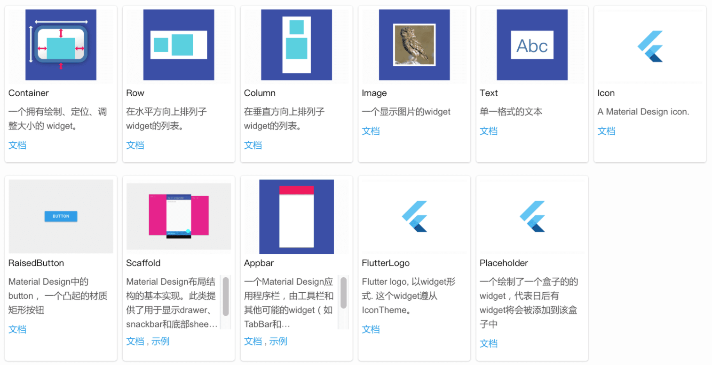

### Flutter的架构设计
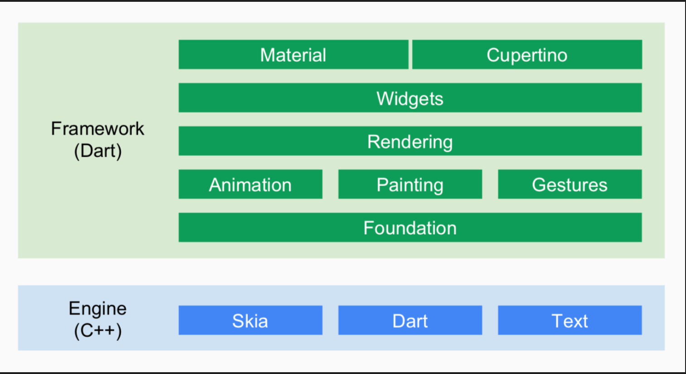

### Flutter原理


一般地来说，计算机系统中，CPU、GPU和显示器以一种特定的方式协作：CPU将计算好的显示内容提交给 GPU，GPU渲染后放入帧缓冲区，然后视频控制器按照 VSync信号从帧缓冲区取帧数据传递给显示器显示。
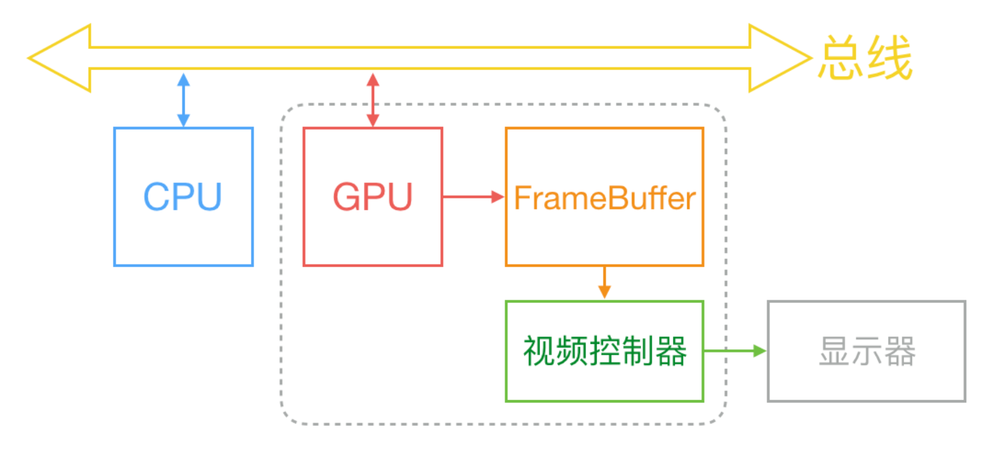
Flutter也不例外，也遵循了这种模式。
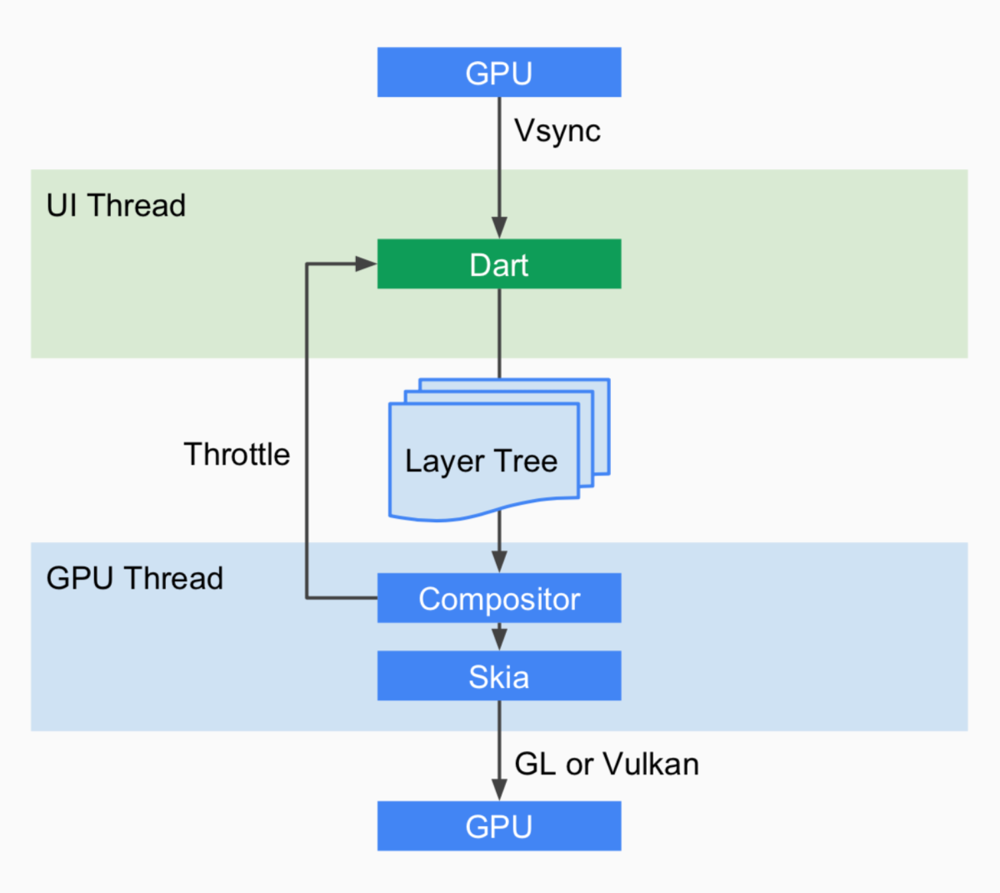
所以从这里可以看出 Flutter和 React-Native之众的本质区别：React-Native之类只是扩展调用 OEM组件，而 Flutter是自己渲染。  
## 开发环境搭建
## Flutter命令

- 检查环境：flutter doctor
- 创建项目：flutter create project
- 安装依赖：flutter pub get
- 运行项目：flutter run
- 编译项目：flutter build apk / flutter build ios
- 调试项目：flutter attach
## Dart语言
## Widget简介

1. StatelessWidget

State_less_ widgets 是不可变的，这意味着它们的属性不能改变 —— 所有的值都是 final。
State_less_ widgets are immutable, meaning that their properties can’t change—all values are final.

2. StatefulWidget

State_ful_ widgets 持有的状态可能在 widget 生命周期中发生变化，实现一个 stateful widget 至少需要两个类：
 1）一个 StatefulWidget 类；
2）一个 State 类
StatefulWidget 类本身是不变的，但是 State 类在 widget 生命周期中始终存在。
State_ful_ widgets maintain state that might change during the lifetime of the widget. Implementing a stateful widget requires at least two classes: 1) a StatefulWidget class that creates an instance of 2) a State class. The StatefulWidget class is, itself, immutable and can be thrown away and regenerated, but the State class persists over the lifetime of the widget.


Q&A:如何传递一个值到Widget里面？

## 常用组件Components

### 基础组件
### 布局类组件
### 容器类组件
#### Container
Container类似于iOS中的UIView，具有绘制、定位、调整大小功能。通常用来装载其它子控件，假如Container没有子控件，它将自动填充整个屏幕；反之，会根据子控件大小，调整自身大小，从而达到自适应效果。Container是flutter开发中最常用的组件，它有以下特点：

1. 当Container没有child组件的时候，Container的宽高默认占满父控件，也就是全屏；
1. 当Container有child组件的时候，宽高以child组件的宽高同等大小，也就是wrap_content；
3. 当Container的child组件为Row或者Column的时候，要为主轴添加 MainAxisSize.min，否则Container在主轴上是铺满的；
3. 如果把这个Container放到ListView中，这个MainAxisSize.min是不起作用的，依然是占满屏幕宽度。
#### Scaffold

### 可滚动组件
#### ListView
滚动列表组件，常用于聚合图文场景 
#### GridView

### 功能型组件

## 状态管理
## 路由管理
## 包管理
### YAML配置文件
配置文件pubspec.yaml（位于项目根目录）
YAML 是一种直观、可读性高并且容易被人类阅读的文件格式，和 xml 或 Json 相比它语法简单并非常容易解析，所以 YAML 常用于配置文件，Flutter 也是用 yaml 文件作为其配置文件。Flutter 项目默认的配置文件是pubspec.yaml，我们看一个简单的示例：
```yaml
name: flutter_in_action
description: First Flutter Application.

version: 1.0.0+1

dependencies:
  flutter:
    sdk: flutter
  cupertino_icons: ^0.1.2

dev_dependencies:
  flutter_test:
    sdk: flutter
    
flutter:
  uses-material-design: true
```

- name：应用或包名称。
- description: 应用或包的描述、简介。
- version：应用或包的版本号。
- dependencies：应用或包依赖的其它包或插件。
- dev_dependencies：开发环境依赖的工具包（而不是flutter应用本身依赖的包）。
- flutter：flutter相关的配置选项。

如果我们的Flutter应用本身依赖某个包，我们需要将所依赖的包添加到dependencies 下，接下来我们通过一个例子来演示一下如何添加、下载并使用第三方包
### Pub仓库
Pub（[https://pub.dev/](https://pub.dev/) ）是 Google 官方的 Dart Packages 仓库，类似于 node 中的 npm仓库、Android中的 jcenter。我们可以在 Pub 上面查找我们需要的包和插件，也可以向 Pub 发布我们的包和插件。

### 包依赖方式 

1. Pub仓库依赖
```yaml
dependencies:
  flutter:
    sdk: flutter

  # 新添加依赖库
  english_words: ^4.0.0
```

2. 本地依赖

如果我们正在本地开发一个包，包名为pkg1，我们可以通过下面方式依赖：
路径可以是绝对路径或者相对路径
```yaml
dependencies:
	pkg1:
        path: ../../code/pkg1
```

3. git仓库依赖

如果软件包位于仓库的根目录中，请使用以下语法
```yaml
dependencies:
  pkg1:
    git:
      url: git://github.com/xxx/pkg1.git
```
也可以使用path参数指定相对位置，例如：
```yaml
dependencies:
  package1:
    git:
      url: git://github.com/flutter/packages.git
      path: packages/package1   
```
```yaml
  dependencies:
    package1:
        git:
          url: git地址
          ref: 分支名
```

4. 其他依赖方式

上面介绍的这些依赖方式是Flutter开发中常用的，但还有一些其它依赖方式，完整的内容读者可以自行查看：https://www.dartlang.org/tools/pub/dependencies 。
## 资源管理
Flutter APP 安装包中会包含代码和 assets（资源）两部分。Assets 是会打包到程序安装包中的，可在运行时访问。常见类型的 assets 包括静态数据（例如JSON文件）、配置文件、图标和图片等。
### 指定Assets

和包管理一样，Flutter 也使用[pubspec.yaml(opens new window)](https://www.dartlang.org/tools/pub/pubspec)文件来管理应用程序所需的资源，举个例子:
```yaml
flutter:
  assets:
    - assets/my_icon.png
    - assets/background.png
```
assets指定应包含在应用程序中的文件， 每个 asset 都通过相对于pubspec.yaml文件所在的文件系统路径来标识自身的路径。asset 的声明顺序是无关紧要的，asset的实际目录可以是任意文件夹（在本示例中是assets 文件夹）。
在构建期间，Flutter 将 asset 放置到称为 _asset bundle_ 的特殊存档中，应用程序可以在运行时读取它们（但不能修改）。

### 加载Assets

1. 加载文本Assets
- 通过[rootBundle(opens new window)](https://docs.flutter.io/flutter/services/rootBundle.html)对象加载：每个Flutter应用程序都有一个[rootBundle(opens new window)](https://docs.flutter.io/flutter/services/rootBundle.html)对象， 通过它可以轻松访问主资源包，直接使用package:flutter/services.dart中全局静态的rootBundle对象来加载asset即可。
- 通过 [DefaultAssetBundle(opens new window)](https://docs.flutter.io/flutter/widgets/DefaultAssetBundle-class.html)加载：建议使用 [DefaultAssetBundle(opens new window)](https://docs.flutter.io/flutter/widgets/DefaultAssetBundle-class.html)来获取当前 BuildContext 的AssetBundle。 这种方法不是使用应用程序构建的默认 asset bundle，而是使父级 widget 在运行时动态替换的不同的 AssetBundle，这对于本地化或测试场景很有用。

通常，可以使用DefaultAssetBundle.of()在应用运行时来间接加载 asset（例如JSON文件），而在widget 上下文之外，或其它AssetBundle句柄不可用时，可以使用rootBundle直接加载这些 asset，例如：
```dart
import 'dart:async' show Future;
import 'package:flutter/services.dart' show rootBundle;

Future<String> loadAsset() async {
  return await rootBundle.loadString('assets/config.json');
}
```

2. 加载图片

## 调试Flutter应用
### 日志与断点
#### debugger() 声明
```dart
void someFunction(double offset) {
  debugger(when: offset > 30.0);
  // ...
}
```
#### print
#### debugPrint
#### flutter logs
### 调试模式断言
在Flutter应用调试过程中，Dart assert语句被启用，并且 Flutter 框架使用它来执行许多运行时检查来验证是否违反一些不可变的规则。当一个某个规则被违反时，就会在控制台打印错误日志，并带上一些上下文信息来帮助追踪问题的根源。
要关闭调试模式并使用发布模式，请使用flutter run --release运行我们的应用程序。 这也关闭了Observatory调试器。一个中间模式可以关闭除Observatory之外所有调试辅助工具的，称为“profile mode”，用--profile替代--release即可。
### 断点
### 调试应用程序层 
## DevTools
### What can I do with DevTools?
Here are some of the things you can do with DevTools:

- Inspect the UI layout and state of a Flutter app.
- Diagnose UI jank performance issues in a Flutter app.
- CPU profiling for a Flutter or Dart app.
- Network profiling for a Flutter app.
- Source-level debugging of a Flutter or Dart app.
- Debug memory issues in a Flutter or Dart command-line app.
- View general log and diagnostics information about a running Flutter or Dart command-line app.
- Analyze code and app size.

### Inspector View
### Performance View
### CPU Profiler View
### Memory View
### NetWork View
### Memory View
### Debugger
### Loggin View
### APP Size Tool
### 


## Flutter异常捕获

## [CookBook](https://docs.flutter.dev/cookbook)
## Animation

- [Animate a page route transition](https://docs.flutter.dev/cookbook/animation/page-route-animation)
- [Animate a widget using a physics simulation](https://docs.flutter.dev/cookbook/animation/physics-simulation)
- [Animate the properties of a container](https://docs.flutter.dev/cookbook/animation/animated-container)
- [Fade a widget in and out](https://docs.flutter.dev/cookbook/animation/opacity-animation)
## Design

- [Add a Drawer to a screen](https://docs.flutter.dev/cookbook/design/drawer)
- [Display a snackbar](https://docs.flutter.dev/cookbook/design/snackbars)
- [Export fonts from a package](https://docs.flutter.dev/cookbook/design/package-fonts)
- [Update the UI based on orientation](https://docs.flutter.dev/cookbook/design/orientation)
- [Use a custom font](https://docs.flutter.dev/cookbook/design/fonts)
- [Use themes to share colors and font styles](https://docs.flutter.dev/cookbook/design/themes)
- [Work with tabs](https://docs.flutter.dev/cookbook/design/tabs)
## Effects

- [Create a download button](https://docs.flutter.dev/cookbook/effects/download-button)
- [Create a nested navigation flow](https://docs.flutter.dev/cookbook/effects/nested-nav)
- [Create a photo filter carousel](https://docs.flutter.dev/cookbook/effects/photo-filter-carousel)
- [Create a scrolling parallax effect](https://docs.flutter.dev/cookbook/effects/parallax-scrolling)
- [Create a shimmer loading effect](https://docs.flutter.dev/cookbook/effects/shimmer-loading)
- [Create a staggered menu animation](https://docs.flutter.dev/cookbook/effects/staggered-menu-animation)
- [Create a typing indicator](https://docs.flutter.dev/cookbook/effects/typing-indicator)
- [Create an expandable FAB](https://docs.flutter.dev/cookbook/effects/expandable-fab)
- [Create gradient chat bubbles](https://docs.flutter.dev/cookbook/effects/gradient-bubbles)
- [Drag a UI element](https://docs.flutter.dev/cookbook/effects/drag-a-widget)
## Forms

- [Build a form with validation](https://docs.flutter.dev/cookbook/forms/validation)
- [Create and style a text field](https://docs.flutter.dev/cookbook/forms/text-input)
- [Focus and text fields](https://docs.flutter.dev/cookbook/forms/focus)
- [Handle changes to a text field](https://docs.flutter.dev/cookbook/forms/text-field-changes)
- [Retrieve the value of a text field](https://docs.flutter.dev/cookbook/forms/retrieve-input)
## Gestures

- [Add Material touch ripples](https://docs.flutter.dev/cookbook/gestures/ripples)
- [Handle taps](https://docs.flutter.dev/cookbook/gestures/handling-taps)
- [Implement swipe to dismiss](https://docs.flutter.dev/cookbook/gestures/dismissible)
## Images

- [Display images from the internet](https://docs.flutter.dev/cookbook/images/network-image)
- [Fade in images with a placeholder](https://docs.flutter.dev/cookbook/images/fading-in-images)
- [Work with cached images](https://docs.flutter.dev/cookbook/images/cached-images)
## Lists

- [Create a grid list](https://docs.flutter.dev/cookbook/lists/grid-lists)
   - [GridView](https://api.flutter.dev/flutter/widgets/GridView-class.html) widget.

ListView中嵌套GridView

- [Create a horizontal list](https://docs.flutter.dev/cookbook/lists/horizontal-list)
- [Create lists with different types of items](https://docs.flutter.dev/cookbook/lists/mixed-list)
- [Place a floating app bar above a list](https://docs.flutter.dev/cookbook/lists/floating-app-bar)
- [Use lists](https://docs.flutter.dev/cookbook/lists/basic-list)
- [Work with long lists](https://docs.flutter.dev/cookbook/lists/long-lists)
## Maintenance

- [Report errors to a service](https://docs.flutter.dev/cookbook/maintenance/error-reporting)
## Navigation

- [Animate a widget across screens](https://docs.flutter.dev/cookbook/navigation/hero-animations)
- [Navigate to a new screen and back](https://docs.flutter.dev/cookbook/navigation/navigation-basics)
- [Navigate with named routes](https://docs.flutter.dev/cookbook/navigation/named-routes)
- [Pass arguments to a named route](https://docs.flutter.dev/cookbook/navigation/navigate-with-arguments)
- [Return data from a screen](https://docs.flutter.dev/cookbook/navigation/returning-data)
- [Send data to a new screen](https://docs.flutter.dev/cookbook/navigation/passing-data)
## Networking

- [Delete data on the internet](https://docs.flutter.dev/cookbook/networking/delete-data)
- [Fetch data from the internet](https://docs.flutter.dev/cookbook/networking/fetch-data)
- [Make authenticated requests](https://docs.flutter.dev/cookbook/networking/authenticated-requests)
- [Parse JSON in the background](https://docs.flutter.dev/cookbook/networking/background-parsing)
- [Send data to the internet](https://docs.flutter.dev/cookbook/networking/send-data)
- [Update data over the internet](https://docs.flutter.dev/cookbook/networking/update-data)
- [Work with WebSockets](https://docs.flutter.dev/cookbook/networking/web-sockets)
## Persistence

- [Persist data with SQLite](https://docs.flutter.dev/cookbook/persistence/sqlite)
- [Read and write files](https://docs.flutter.dev/cookbook/persistence/reading-writing-files)
- [Store key-value data on disk](https://docs.flutter.dev/cookbook/persistence/key-value)
## Plugins

- [Play and pause a video](https://docs.flutter.dev/cookbook/plugins/play-video)
- [Take a picture using the camera](https://docs.flutter.dev/cookbook/plugins/picture-using-camera)
## Testing
### Integration

- [An introduction to integration testing](https://docs.flutter.dev/cookbook/testing/integration/introduction)
- [Performance profiling](https://docs.flutter.dev/cookbook/testing/integration/profiling)
### Unit

- [An introduction to unit testing](https://docs.flutter.dev/cookbook/testing/unit/introduction)
- [Mock dependencies using Mockito](https://docs.flutter.dev/cookbook/testing/unit/mocking)
### Widget

- [An introduction to widget testing](https://docs.flutter.dev/cookbook/testing/widget/introduction)
- [Find widgets](https://docs.flutter.dev/cookbook/testing/widget/finders)
- [Handle scrolling](https://docs.flutter.dev/cookbook/testing/widget/scrolling)
- [Tap, drag, and enter text](https://docs.flutter.dev/cookbook/testing/widget/tap-drag)

## 基础组件
### 1. 文本
### 2. 按钮
### 3. 图片
Image组件加载图片，数据源可以是asset，文件，内存或者网络。

#### ImageProvider
ImageProvider 是一个抽象类，主要定义了图片数据获取的接口load()，从不同的数据源获取图片需要实现不同的ImageProvider ，如AssetImage是实现了从Asset中加载图片的 ImageProvider，而NetworkImage 实现了从网络加载图片的 ImageProvider。
#### Image
1. 从asset中加载图片
a. 在工程根目录下创建一个images目录，并将图片 avatar.png 拷贝到该目录。
b. 在pubspec.yaml中的flutter部分添加如下内容：
```yaml
  assets:
    - images/avatar.png
```
注意: 由于 yaml 文件对缩进严格，所以必须严格按照每一层两个空格的方式进行缩进，此处 assets 前面应有两个空格。
c. 加载该图片
```dart
Image(
  image: AssetImage("images/avatar.png"),
  width: 100.0
);


//Image也提供了一个快捷的构造函数Image.asset用于从asset中加载、显示图片：

Image.asset("images/avatar.png",
	width: 100.0,
)
```

2. 从网络加载图片
```dart
Image(
  image: NetworkImage(
      "https://avatars2.githubusercontent.com/u/20411648?s=460&v=4"),
  width: 100.0,
)
  
// Image也提供了一个快捷的构造函数Image.network用于从网络加载、显示图片：
  
Image.network(
  "https://avatars2.githubusercontent.com/u/20411648?s=460&v=4",
  width: 100.0,
)
```

3. 


## 布局类组件

- LeafRenderObjectWidget
- SingleChildRenderObjectWidget
- MultiChildRenderObjectWidget

Flutter中的布局是通过组装布局Widget实现，布局模型本身也是Widget。
The core of Flutter’s layout mechanism is widgets. In Flutter, almost everything is a widget—even layout models are widgets.

Flutter中用于布局的Widget可以分为两类：只能有单个child的布局Widget，可以有多个child的布局Widget。

单个child的布局Widget

1. **Container**: 可以给child指定padding，margin，align，decoration,BoxConstraints等属性
1. **Padding**: 可以给child指定padding
1. **Align**: 可以给child指定align
1. **Center**: child位于Widget中心位置
1. **FittedBox**: 支持几种固定布局方式，类似ImageView.ScaleType
1. **AspectRatio**: 指定一个ratio，child的长宽比始终等于这个ratio：
1. **ConstrainedBox**：可以给child指定BoxConstraints
1. **Baseline**：根据Child的基线对它们的位置进行布局。
1. **FractionallySizedBox**：可以指定可用空间，然后把child放在可用空间的部分位置
1. **IntrinsicHeight**：将它的child的高度调整其本身实际的高度
1. **IntrinsicWidth**：将它的child的宽度调整其本身实际的宽度
1. **LimitedBox**：当自身不受约束时才限制child大小
1. **Offstage**：设置visilibity
1. **OverflowBox**：对其子项施加不同约束的widget，它可能允许子项溢出父级
1. **SizedBox**：一个特定大小的盒子。这个widget强制它的孩子有一个特定的宽度和高度。如果宽度或高度为NULL，则此widget将调整自身大小以匹配该维度中的孩子的大小。
1. **SizedOverflowBox**：一个特定大小的widget，但是会将它的原始约束传递给它的孩子，它可能会溢出。
1. **Transform**：在绘制child之前实施转换的widget
1. **CustomSingleChildLayout**：自定义单个child布局


多个child的布局widget

1. **Row**：水平布局
1. **Column**：垂直布局
1. **Stack**：允许child重叠布局
1. **IndexedStack**：显示列表中指定child
1. **GridView**：网格布局
1. **Flow**：Flow布局
1. **Table**：table布局
1. **Wrap**：自动换行布局
1. **ListView**：listview
1. **CustomMultiChildLayout**：自定义多个child布局

布局Widget详细介绍：[https://flutter.io/widgets/layout/](https://flutter.io/widgets/layout/)

如何创建一个响应式APP
[https://github.com/flutter/flutter/wiki/Creating-Responsive-Apps](https://github.com/flutter/flutter/wiki/Creating-Responsive-Apps)

Flutter allows you to create apps that self-adapt to the device's screen size and orientation.
There are two basic approaches to creating Flutter apps with responsive design:

- **Use the **[LayoutBuilder](https://docs.flutter.io/flutter/widgets/LayoutBuilder-class.html)** class:** From its [builder](https://docs.flutter.io/flutter/widgets/LayoutBuilder/builder.html) property, you get a [BoxConstraints](https://docs.flutter.io/flutter/rendering/BoxConstraints-class.html). Examine the constraint's properties to decide what to display. For example, if your [maxWidth](https://docs.flutter.io/flutter/rendering/BoxConstraints/maxWidth.html)is greater than your width breakpoint, return a [Scaffold](https://docs.flutter.io/flutter/material/Scaffold-class.html) object with a row that has a list on the left. If it's narrower, return a [Scaffold](https://docs.flutter.io/flutter/material/Scaffold-class.html) object with a drawer containing that list. You can also adjust your display based on the device's height, the aspect ratio, or some other property. When the constraints change (e.g. the user rotates the phone, or puts your app into a tile UI in Nougat), the build function will rerun.
- **Use the **[MediaQuery.of()](https://docs.flutter.io/flutter/widgets/MediaQuery/of.html)** method in your build functions:** This gives you the size, orientation, etc, of your current app. This is more useful if you want to make decisions based on the complete context rather than on just the size of your particular widget. Again, if you use this, then your build function is automatically rerun if the user changes the app's size somehow.

These other widgets may also be useful if you want to dynamically adjust an app's display:

- [AspectRatio](https://docs.flutter.io/flutter/widgets/AspectRatio-class.html) lets you force a child widget to a particular aspect ratio.
- [FittedBox](https://docs.flutter.io/flutter/widgets/FittedBox-class.html) scales its child to fit.
- [CustomMultiChildLayout](https://docs.flutter.io/flutter/widgets/CustomMultiChildLayout-class.html) lets you lay out your children based on the incoming size.


总结

- Flutter通过布局widget的组合实现页面布局。可以看到Flutter将常用的布局模式细化为布局Widget，让开发者直接选择某个去使用。对比CAF提供的布局策略，更倾向于提供基础layout控件，让开发者自由发挥。
- 对于响应式UI的创建，flutter建议使用LayoutBuilder以及MediaQuery，通过父容器的布局约束信息以及当前的设备信息，由开发者主动选择合适的UI布局，另外可以辅助使用AspectRatio、FittedBox 以及 CustomMultiChildLayout这些布局Widget动态调整布局。从AliOS的适配过程中遇到的问题来看，AspectRatio，FittedBox这些布局模式，能够解决一些Ued设计中的special case，可以考虑融合到框架中。

## 容器类组件
## 可滚动组件
### ListView的使用
## 功能型组件
### 导航返回拦截（WillPopScope）
### 数据共享（InheritedWidget）
### 跨组件状态共享（Provider）
## 
事件与通知
### 原始指针事件处理（Pointer Event）
### 手势识别
#### GestureDetector
#### GestureRecognizer
### Flutter事件处理
### 手势原理和手势冲突
### 全局事件总线
### 通知（Notification）
## 动画
## 自定义组件
## 文件操作
## 网络请求
## Flutter和Native的通信
Flutter与原生交互有三种方法，分别是MethodChannel，EventChannel与BasicMessageChannel：

1. BaseMethodChannel ：用来传递字符串和半结构化信息
1. MethodChannel：用于传递方法的调用（Method invocation）
1. EventChannel：用于数据流的通信（event streams）

MethodChannel提供了Flutter与原生代码的方法调用的通道，并且可以得到所调用函数返回的数据；

EventChannel则是事件传递，可以将Flutter的一个事件（比如监听）交给原生平台，原生平台去做监听，当收到广播后借助EventChannel调用Flutter注册的监听，完成对Flutter的事件通知；

BasicMessageChannel用于传递数据，Flutter与原生资源不共享，可以通过BasicMessageChannel获得原生的资源比如图片等。

Flutter和原生代码的相互调用就是通过MethodChannel，调用方与被调用方分别创建MethodChannel并分别调用invokeMethod()与setMethodCallHandler()即可。

## [Flutter数据传递](./flutter数据传递.md)

## 核心原理
### UI框架（Framework）
### Element、BuildContext和RenderObject
### Flutter启动流程
### Flutter渲染管线
### 布局过程（Layout）
### 绘制原理及Layout
### 组件树绘制流程
### Layout实例
### Compositing
## 打包发布

# Flutter诞生背景
Flutter是一个有谷歌开发的开源移动应用软件开发工具包，用于作为Android和iOS开发应用，同时也将是Google Fuchsia下开发应用的主要工具。
### Flutter 是什么

- Google 新一代跨平台 UI 框架，Dart 语言

    （2013年创建项目，2018年底第一个预览版）

   - 现代响应式UI 框架（类比Facebook React）
   - 高性能（从Web优化项目孵化，成员：chrome/blink内核）
   - 高度跨平台 (移动，嵌入式，桌面，Web)
- Google 下一代物联网操作系统 [Fuchsia OS](https://fuchsia.dev/) 官方指定应用开发框架。类比：华为 鸿蒙OS，Ubuntu Core等，微内核、非 Linux。Flutter被指为Android向物联网开发生态过渡战略。

 
     Flutter 技术架构 
                 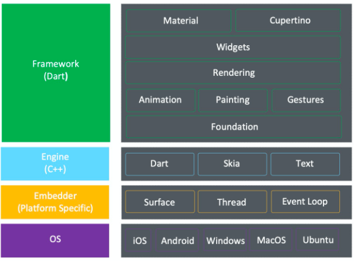

跨平台技术发展：

- WebView 技术：调用浏览器内核渲染（目前小程序主流）。
- Native 渲染： 中间层转换，最终渲染调用Android/iOS原生控件（RN/Weex）。
- 自渲染：自绘引擎，不依赖 OS （Flutter、QtQuick / AGIL engine）。

Flutter 特点

- 开发效率：Hot reload，可视化，研发效率和前端基本持平（据说）。
- 高度跨端一致性

    移动端：Android、iOS
    桌面：macOS、Linux、Windows
    嵌入式：Linux / RTOS based IoT 移植成本很低
    Web:  Dart 运行在浏览器（官方Flutter for web：Dart -> JS）

> 底层：Skia 图形库非常成熟（ Android，Chromium，Flutter）
> 支持从 Software 到 GPU：OpenGL、Vulkan、Metal 各种后端

 
总结：和之前的跨平台技术相比，Flutter性能更好，更接近原生并且跨平台体验更优秀。
Github Star 已超越前辈 React-Native。（当前 bug 数量也很感人）

其他：

- UI表现力：Demo直观感受[ Vignettes by gskinner](https://www.youtube.com/watch?v=MI7Rl2umeeU) （Flutter Interact 2020）

  打破 UI 和 游戏引擎界限

- Code Push / 动态化 能力 （[不支持](https://github.com/flutter/flutter/issues/14330)）：
> “Currently we do not offer such a solution out of the box, 
>    but the primary blockers are not technological. ”（非技术原因，苹果政策影响）


- 与Chromium超大规模项目（1000w行代码）相比，Flutter（可控可定制）小型系统

Dart语言：

- AOT：Ahead of Time 编译为机器码（二进制，运行效率优于JS）
- Dart 在服务端/中后台 （多端一体化）


### 业界现状

主流厂商投入（使用）情况

阿里 
• 淘宝、淘宝特价版、闲⻥、蚂蚁财富、UC、优酷、ICBU、饿了么、考拉、⻜猪等
 
Tencent 
• 微信、腾讯Now直播、腾讯翻译君等 
 
字节跳动 
• 今日头条，⻄⽠视频、⽪⽪虾、Helo 等 20+
 
快⼿
 • 快影等 
 
美团 
• 美团骑⼿、美团外卖商家版、美团众包等 
 
百度 
• 贴吧等

> 混合开发模式： 在原有项目基础上，对某些业务进行改造成flutter尝试新技术。


**端侧 Flutter 应用总结：**

- 原生 Flutter 方式：微信（表情商店），今日头条， 快手， 美团众包
- Canvas：今日头条小游戏，西瓜视频小游戏
- 跨平台渲染：微信小程序，美团小程序


#### 解决问题

#### 语言特性

#### 使用场景

#### 优缺点

#### 性能对比

#### 学习路线

1. 环境配置
1. 第一个Flutter应用 HelloWorld
1. Flutter路由解析 [https://yuque.antfin.com/aet2si/bhq6po/xg6oip](https://yuque.antfin.com/aet2si/bhq6po/xg6oip)
1. AliFlutter

#### 落地步骤

1. 基础学习
1. 基础组件实现
   1. 网络请求
   1. 数据存储
   1. 图片加载
   1. 日志上报
   1. 滑动组件
3. 打包编译流程
3. 性能优化
   1. 内存检测方法 _https://github.com/alibaba/flutter-go  _
   1. 卡顿 [https://yuque.antfin.com/xytec/fmhron/igbgyg](https://yuque.antfin.com/xytec/fmhron/igbgyg)
   1. 性能监控 [https://yuque.antfin.com/flutter-apm/mruaxm/ldpw64](https://yuque.antfin.com/flutter-apm/mruaxm/ldpw64)
   1. 


5. 公共组件
5. 


#### MORE

- 官网 [https://flutter.dev/](https://flutter.dev/)
- Flutter 仓库 [https://pub.flutter-io.cn/](https://pub.flutter-io.cn/)
## 
##  观点：为什么移动端跨平台开发不靠谱？

首先看一下跨平台解决方案的目的是什么？

跨平台解决方案旨在通过为多个平台使用单一的变成语言来降低成本、简化工作量。

#### 适用场景

使用场景简单，个人或者小团队，简单应用，保持一致性

#### 推荐使用跨平台的场景

-  游戏
游戏通常不依赖本机组件，无论2D还是3D，游戏一般都是建立在OpenGL上，其中的性能非常好，视觉逻辑构成了应用程序很大一部分，可以跨平台。推荐Unity或者Unreal这样的东西。 
-  快速原型 

### Flutter 与 Weex 对比


**运行时：**

js 或 dart 都是一种声明式的写法，但 js 需要转译，dart可直接AOT编译成native代码，VM 效率更高。运行上应该是 dart 效率高很多。

**渲染机制：**

在表达复杂UI的情况下，weex 的div会深层次叠加的嵌套，使用native的view对应，层级越多就会增加增加主线程渲染时间和内存占用。

Flutter 是基于skia，每个widget是否一定需要是一个layer tree对应，怎么来划分和实现都具有更多灵活性和性能优化的空间，能做到性能更优。

**组件的兼容性：**

Weex 使用的平台相关view就会有平台的局限性，

Flutter 的widget都是基于 skia 来实现和精心定制的，与具体平台无关，所以能保持很好的兼容性和跨平台能力。

### 现有工程接入Flutter成本


- 包大小android新增7M，iOS新增15M左右
- 架构调整
- mtl自动打包、构建发布
- 第二库，第三库桥接成本与后期维护成本，例如mtop，orange等等
- Dart调用native特性，需要写平台插件 
- 混编编程、调试成本
- Dart 语言学习成本


### 几个问题


了解 Flutter的基本概念后，自然有几个疑问亟待解决。

**1.为什么使用 Dart？**

1. Dart 的性能更好。Dart在 JIT模式下，速度与 JavaScript基本持平。但是 Dart支持 AOT，当以 AOT模式运行时，JavaScript便远远追不上了。速度的提升对高帧率下的视图数据计算很有帮助。
1. “因为 Dart 的开发团队就在他们旁边，他们能给到我们很快的支持。我们能很快沟通到”
1. Dart是**类型安全**的语言，拥有完善的包管理和诸多特性。Google召集了如此多个编程语言界的设计专家开发出这样一门语言，旨在取代 JavaScript，所以 Fuchsia OS内置了 Dart。Dart可以作为 embedded lib嵌入应用，而不用只能随着系统升级才能获得更新，这也是优势之一。


**2.Skia是什么？**

前面提到了 Flutter只关心如何构建视图抽象结构，向 GPU提供视图数据。Skia就是 Flutter向 GPU提供数据的途径。

Skia是一个 2D的绘图引擎库，其前身是一个向量绘图软件，Chrome和 Android均采用 Skia作为绘图引擎。Skia提供了非常友好的 API，并且在图形转换、文字渲染、位图渲染方面都提供了友好、高效的表现。Skia是跨平台的，所以可以被嵌入到 Flutter的 iOS SDK中，而不用去研究 iOS闭源的 Core Graphics / Core Animation。
Android自带了 Skia，所以 Flutter Android SDK要比 iOS SDK小很多。
**3.端转场动画和View动画**

从闲鱼那边的反馈来看，Flutter的动画操作起来比较复杂，动画部分都由native接管

**4.flutter不能跨三端，不能降级h5？而weex支持动态性，flutter是否支持动态性？**

对动态性能要求高，就用weex，对交互或性能要求高，可以选择flutter作为native替代。动态化理论可行，支持动态意味着Dart源代码需要以 JIT方式运行，而Flutter的 production build是 AOT代码。所以需要修改Flutter Engine SDK的 build option里面可以设置 mode = release， AOT = false


## Flutter 的 PageStorageKey
在Flutter里面，一个包含了滚动视图的页面如果重新加载，那么滚动视图就会被重新创建而滚动到顶部。 如果我们给这个列表添加一个pageStorageKey，它就会存储该列表的滚动位置信息，重新加载也不会滚动到顶部了，而是展示上次滑动到的位置，保持了锚点。

我们的项目中，很多滑动列表组件都封装了key，用来举例不是很简洁。Flutter官网上的第一个例子是一个讲述ListView组件的例子，非常简洁，我们可以借用一下它来尝试说明一下PageStorageKey的用法（地址：[https://flutterchina.club/get-started/codelab/](https://flutterchina.club/get-started/codelab/)）。
通过下面的代码可以生成一个列表，点击列表里的数据，空心icon会变成红心，我们用这个红心来观察我们滚动的位置。点击右上角的icon，会跳转到一个二级页面，然后点击返回，在首页上会展示我们刚刚滑动到的位置。
这个是正常的，因为首页并没有发生重建，它一直保存在这里。

接下来，让我们尝试在二级页面返回的时候，触发首页的重建。我们给首页添加一个UniqueKey(). 至于为什么UniqueKey会触发重建，我们在flutter的分享里面已经说过了。
再次运行，就会发现，从二级页面返回的时候，首页的listView没有滚动到顶部，而是保留了锚点。
总的来说，如果在页面发生重建，而又想保留锚点的时候，PageStorageKey是一个很好的选择。

## 什么是 Flutter

Flutter allows you to build beautiful native apps on iOS and Android


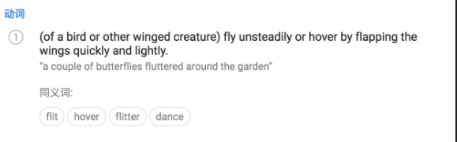

[https://translate.google.cn/?source=osdd#view=home&op=translate&sl=auto&tl=zh-CN&text=flutter](https://translate.google.cn/?source=osdd#view=home&op=translate&sl=auto&tl=zh-CN&text=flutter)


## 为什么是 Flutter？
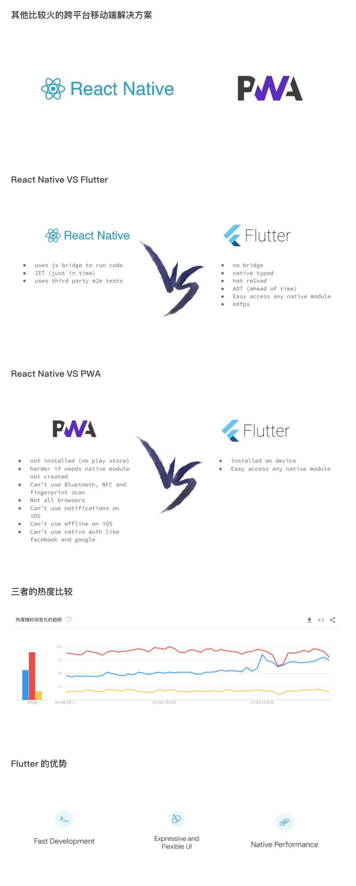

- Hot Reload，支持 JIT
- 性能好，自建渲染引擎，和 Chrome 相同内核
- 跨端，丰富的 Android 和 iOS 组件，未来会支持 Web，Mac 等其他端
- 响应式编程


## 移动端架构概况

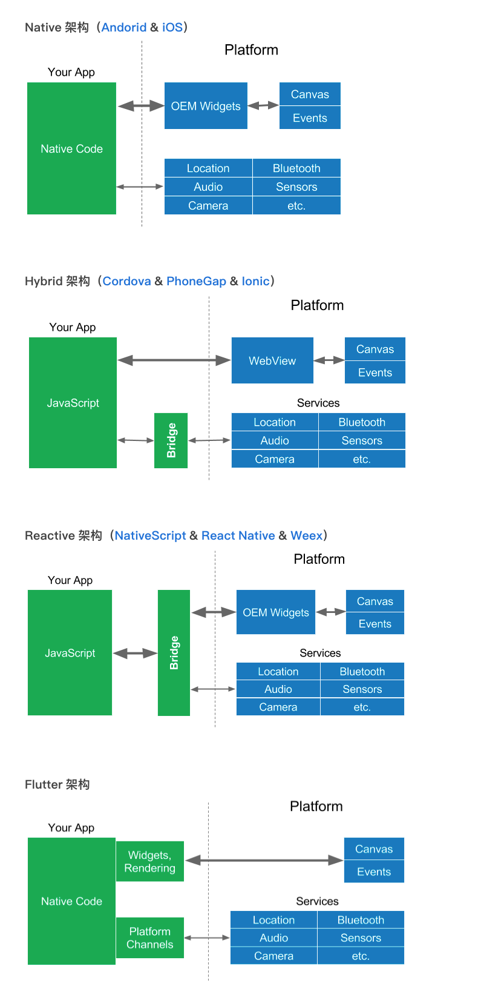

------
[Flutter System Architecture](https://docs.google.com/presentation/d/1cw7A4HbvM_Abv320rVgPVGiUP2msVs7tfGbkgdrTy0I/edit#slide=id.p)


### SKIA

[Skia](https://skia.org/) 是一个 2D的绘图引擎库，其前身是一个向量绘图软件，Chrome和 Android均采用 Skia作为绘图引擎。Skia提供了非常友好的 API，并且在图形转换、文字渲染、位图渲染方面都提供了友好、高效的表现。Skia是跨平台的，所以可以被嵌入到 Flutter的 iOS SDK中，而不用去研究 iOS闭源的 Core Graphics / Core Animation。


### Widget

Everything is a Widget

```dart
///<div class="greybox">
///    Lorem ipsum
///</div>

///.greybox {
///  background-color: #e0e0e0;
///  width: 320px;
///  height: 240px;
///  font: 900 24px Georgia;
///}
var container = new Container( // grey box
  child: new Text(
    "Lorem ipsum",
    style: new TextStyle(
      fontSize: 24.0
      fontWeight: FontWeight.w900,
      fontFamily: "Georgia",
    ),
  ),
  width: 320.0,
  height: 240.0,
  color: Colors.grey[300],
);
```


- [https://flutter.io/widgets/](https://flutter.io/widgets/)
- [https://flutter.io/widgets/widgetindex/](https://flutter.io/widgets/widgetindex/)


### Platform Channels


通过 platfom channel机制，既可以与系统服务进行通信，也可以实现 flutter 与原生API的互相调用，让界面开发只关心UI实现。


### Dart

[https://www.dartlang.org/guides/language/language-tour](https://www.dartlang.org/guides/language/language-tour)


- 单线程，[Event Loop](https://segmentfault.com/a/1190000008800122)
- 面向对象
- 强类型
- Dart VM: Hot reload
- Tree shaking
- JIT & AOT


### 图形管道


跟 Android 5.x View Rendering Pipeline 一样，Flutter 的渲染流水线也包括两个线程 —— UI 线程和 GPU 线程。UI 线程主要负责的是根据 UI 界面的描述生成 UI 界面的绘制指令，而 GPU 线程负责光栅化和合成。
Flutter 以图层树（Layer Tree）的方式对生成的 UI 界面绘制指令进行组织，而从 Android 4.x 开始，Android View Rendering 使用的 View DisplayList 树的方式，虽然组织的方式有所差异，但是其中的主要内容都是 UI 界面的绘制指令。而图层树这种组织方式又非常类似 WebKit/Blink。


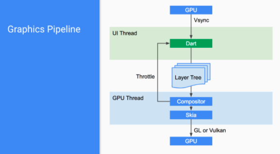


CPU将计算好的显示内容提交给 GPU，GPU渲染后放入帧缓冲区，然后视频控制器按照 VSync信号从帧缓冲区取帧数据传递给显示器显示。，当一帧图像绘制完毕后准备绘制下一帧时， 视频控制器会向GPU发出一个垂直同步信号（VSync）。flutter的优势在于Flutter只关心向 GPU提供视图数据，GPU的 VSync信号同步到 UI线程，UI线程使用 Dart 来构建抽象的视图结构，这份数据结构在 GPU线程进行图层合成，视图数据提供给 Skia引擎渲染为 GPU数据，这些数据通过 OpenGL 或者 Vulkan提供给 GPU。


------
[https://yuque.antfin-inc.com/tb_qn/puq7xs/taz9sg](https://yuque.antfin-inc.com/tb_qn/puq7xs/taz9sg)
[https://zhuanlan.zhihu.com/p/38431912](https://zhuanlan.zhihu.com/p/38431912)


### 渲染管道

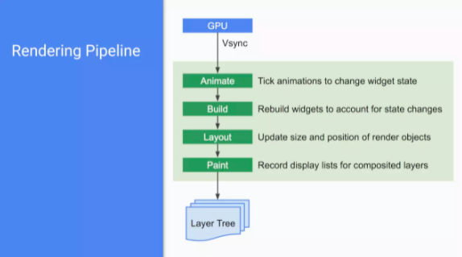


1. 运行动画，动画的结果会导致 Widget State 的改变；
1. State Changes 触发 Flutter 生成一棵新的 Widget 树；
1. Flutter 根据新/旧 Widget 树的差异更新 Render 树，重新排版更新界面布局；
1. Flutter 根据新的 Render 树更新 Composited Layer（合成图层）的 Display List；
1. 输出新的图层树；

------
[https://zhuanlan.zhihu.com/p/38431912](https://zhuanlan.zhihu.com/p/38431912)


### 线程模型

Flutter里面包括下面2大线程管理，当我们讨论多线程的时候一定要先要区分是在 engine 还是 dart。


#### TaskRunner

Flutter  Engine本身不会直接管理Thread。它抽象了TaskRunner的概念，由embedder来负责TaskRunner和Thread的配置关系

| **TaskRunner类型** | **Thread映射关系** | **功能职责** |
| --- | --- | --- |
| **Platform Task Runner** | （1）在安卓和iOS等同于主线程（Main Thread），如果自己创建了多个engine实例，也只会有一个Platform Task Runner；
（2）在Fuchsia系统上会比较特殊，Flutter作为Fuchsia上App的渲染引擎，需要为每个App会创建一个独立的Platform Task Runner； | 执行embedder的代码，和平台通讯，所有和engine交互的代码都必须在该TaskRunner种执行，否则可能导致异常；

过载则不会导致Flutter应用卡顿，原因是flutter界面渲染工作不在这里执行； |
| **UI Task Runner** | 每个engine的实例会有一个独立的UI Thread | 执行root isolate的dart代码，主要负责界面渲染相关的工作，此外还负责来自Native Plugin、Timers、Microtasks、异步IO（socket，file  handles）的响应处理；

过载则会导致Flutter应用卡顿； |
| **GPU Task Runner** | 每个engine的实例会有一个独立的GPU Thread | 负责GPU相关的工作；UI Task Runner创建的Layer Tree是跨平台的，它不关心到底由谁来完成绘制。目前flutter支持OpenGL、Vulkan、 Software、Skia等多种渲染方式，GPU Task Runner负责将Layer Tree提供的信息转化为平台支持的GPU指令。

过载则会导致Flutter应用卡顿； |
| **IO Task Runner** | 每个engine的实例会有一个独立的IO Thread | 负责IO相关工作，主要职责是从图片存储（比如磁盘）中读取压缩的图片格式（比如PNG，JPEG），将其解压转换成GPU能够处理的格式，然后将数据上传给GPU。 |


#### DartVM


由DartVM有自己的线程池（Thread  Pool），但是无论是engine还是embedder都没有访问权限；
Dart也没有直接使用Thread的概念，而是抽象了isolate的概念来实现并发；


isolate是Dart语言的一个核心概念，类似Thread但是差异也很大，请参考官方文档。
[https://webdev.dartlang.org/articles/performance/event-loop](https://webdev.dartlang.org/articles/performance/event-loop)
[https://www.yuque.com/xytech/flutter/kwoww1](https://www.yuque.com/xytech/flutter/kwoww1)
------
[https://yuque.antfin-inc.com/zbf9ic/mgdwg7/phuppl](https://yuque.antfin-inc.com/zbf9ic/mgdwg7/phuppl)
[https://github.com/flutter/engine](https://github.com/flutter/engine)
[https://www.yuque.com/xytech/flutter/kwoww1](https://www.yuque.com/xytech/flutter/kwoww1)


## 安装配置


预安装

- Android Studio
- XCode


flutter安装

```bash
export PUB_HOSTED_URL=https://pub.flutter-io.cn
export FLUTTER_STORAGE_BASE_URL=https://storage.flutter-io.cn
git clone -b dev https://github.com/flutter/flutter.git
export PATH="$PWD/flutter/bin:$PATH"
cd ./flutter
flutter doctor
```

------
[https://flutter.dev/community/china](https://flutter.dev/community/china)


编辑器

- VSCode
   - dart 插件和 flutter 插件
- Android Studio
   - 同上
- IntelliJ IDEA
   - 同上


包管理

- pub
- [https://pub.dartlang.org/flutter](https://pub.dartlang.org/flutter)
- 私有化 [https://yuque.antfin-inc.com/zbf9ic/mgdwg7/xytyma](https://yuque.antfin-inc.com/zbf9ic/mgdwg7/xytyma)


更新

- flutter upgrade


## 通过 DEMO 进行学习


演示代码： [Hello world](https://github.com/flutter/flutter/blob/master/examples/hello_world/lib/main.dart)


代码结构


## 创建新的 APP


1. Invoke **View > Command Palette**.
1. Type “flutter”, and select the **Flutter: New Project**.
1. Enter a project name, such as `myapp`, and press **Enter**.
1. Create or select the parent directory for the new project folder.
1. Wait for project creation to complete and the `main.dart` file to appear.


```dart
class MyHomePage extends StatefulWidget {
  final String title;
  
  MyHomePage({Key key, this.title}) : super(key: key);

  @override
  _MyHomePageState createState() => _MyHomePageState();
}
```


```dart
class _MyHomePageState extends State<MyHomePage> {
  int _counter = 0;

  void _incrementCounter() {
    setState(() {
      _counter++;
    });
  }

  @override
  Widget build(BuildContext context) {
    return Scaffold(
      appBar: AppBar(
        title: Text(widget.title),
      ),
      body: Center(
        child: Column(
          mainAxisAlignment: MainAxisAlignment.center,
          children: <Widget>[
            Text(
              'You have pushed the button this many times:',
            ),
            Text(
              '$_counter',
              style: Theme.of(context).textTheme.display1,
            ),
          ],
        ),
      ),
      floatingActionButton: FloatingActionButton(
        onPressed: _incrementCounter,
        tooltip: 'Increment',
        child: Icon(Icons.add),
      ),
    );
  }
}
```


## StatelessWidget 和 StatefulWidget


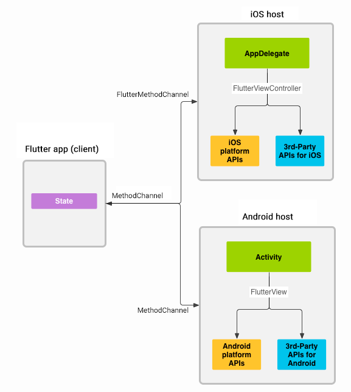


渲染过程

- Flutter 使用 React 的思想，维护一棵 Widget Tree；
- Widget 包括 StatelessWidget 和 StatefulWidget，它们又可以相互包含；
- Widget Tree 的树叶是许多可真正被绘制于屏幕上的 RenderObject；
- UI 的更新通过 State 的改变触发，逐层触发各个 Widget、RenderObject 的属性改变，Flutter 帮我们对比改变前后需要重绘的 RenderObject 后，使用 skia 2D 图形库绘制所需的 RenderObject；
- 这些 RenderObject 是各种圆圈、直线曲线、填充、渐变等，Flutter 通过仅更新这些必要的部分来提高 UI 性能。


上面这图可以成为视图树（View Tree），Flutter 的视图结构的抽象分为三个部分：`Widget` , `Element` , `RenderObject` 。其实这三部分也就是对应着 模型树、呈现树、渲染树。

- Widget 是 Flutter 中控件实现的基本单位，里面存储了一个视图的配置信息，包括布局、属性等。
- Element 是 Widge 的抽象，它继承了视图构建的上下文数据，通过它遍历视图树。
- RenderObject 负责 Layout、Paint，RenderObject 树构建的数据会被加入到 Engine所需的 LayerTree 中，Engine通过 LayerTree 进行视图合成并光栅化，提交给 GPU。


Flutter 通过这三个概念，把原本比较复杂的视图树状态、数据的维护和构建拆分得更单一、易于维护。
------

- [https://zhuanlan.zhihu.com/p/36577285](https://zhuanlan.zhihu.com/p/36577285)
- [https://flutter.io/widgets-intro/](https://flutter.io/widgets-intro/)
- [https://segmentfault.com/a/1190000011949751](https://segmentfault.com/a/1190000011949751)
- [https://yuque.antfin-inc.com/junnan.spjn/memo/about-flutter](https://yuque.antfin-inc.com/junnan.spjn/memo/about-flutter)
- [https://juejin.im/post/5b4c6054e51d4519475f1d5d](https://juejin.im/post/5b4c6054e51d4519475f1d5d)
- [https://www.stephenw.cc/2018/05/28/flutter-dart-framework/](https://www.stephenw.cc/2018/05/28/flutter-dart-framework/)


## 指标数据


### 基础指标


#### iPhone6

- **内存： **多7MB**多9MB**
- **CPU:**  Flutter CPU资源占用较Native占优
- **冷启动速度**： Flutter要慢345ms


#### iPhoneX

- **内存： **多9MB**多13MB**
- **CPU**:  Flutter CPU资源占用较Native占优
- **冷启动速度**： Flutter要慢94ms


#### 包size

- 压缩后文件大小： 增加9.428 MB
- 安装后文件大小： 增加24.051 MB


### FPS

| 版本 | 帧率（fps） | GPU使用率 |
| --- | --- | --- |
| Native | 56 - 60 | 65% - 72% |
| Weex | 43 - 60 | 17% - 22% |
| Flutter | 57 - 60 | 32% - 37% |


| FPS | Flutter == Native > Weex |
| --- | --- |
| GPU使用率 | Native > Flutter > Weex |
| Main 线程负载 | Native > Weex > Flutter |


### AOT 和 JIT 的对比

| **衡量维度** |  | **AOT** | **JIT** | **对比** |
| --- | --- | --- | --- | --- |
| 启动速度

（测试方案：冷启动20次） | didFinishLaunching | 49.62 | 48.49 | Native时间，无明显差异 |
|  | createController | 30.70 | 91.17 | JIT是AOT的2.97倍 |
|  | viewDidAppear | 20.17 | 193.17 | JIT是AOT的9.58倍 |
|  | 启动后内存占用情况 | 22.53 | 54.39 | JIT是AOT的2.41倍 |
| 包Size
(ARM64单架构)
双架构待测试 | App大小 | 19.7MB | 37.9MB | JIT对包Size影响较大 |
|  | App.framework | 6.7M | 0MB | JIT对包Size影响较大，但是JIT产物估计是不区分CPU架构的。 |
|  | flutter_asset | 836K | 19M

kernel_blob.bin文件最大15MB |  |
|  | Flutter.framework | 11M | 17M | JIT对包Size影响较大 |


------
[https://yuque.antfin-inc.com/zbf9ic/mgdwg7/ghz8hx](https://yuque.antfin-inc.com/zbf9ic/mgdwg7/ghz8hx)


## 一款非官方语雀客户端


------
[https://github.com/okoala/yuque](https://github.com/okoala/yuque)


## 了解更多

- [codelabs](https://codelabs.flutter-io.cn/)
- [Build Native Mobile Apps with Flutter](https://cn.udacity.com/course/build-native-mobile-apps-with-flutter--ud905)
- [https://flutter.io/cookbook/](https://flutter.io/cookbook/)

国内关注 flutter 的还有……

- [阿里闲鱼技术](https://zhuanlan.zhihu.com/p/36577285)
- 京东金融 App 研发团队
- 手机京东技术团队
- 58 无线技术
- etc.

## 提升跨端能力：Flutter容器化

从工程角度看，虽然Flutter通过Skia跨平台图形渲染和自建事件体系基本实现了对宿主平台的最小依赖，但对于平台侧能力，目前Flutter还未也没有必要从应用框架角度做到一个统一的抽象，这就需要我们根据业务的诉求和特点进行有选择的封装。小程序API就做了一个非常好的示范，目前阿里小程序体系提供的API达到了200+，很好的对移动端的UI、多媒体、文件缓存、网络、设备能力、数据安全以及业务相关能力进行了封装，让业务开发者在小程序侧针对API进行系统能力调用，无需关心平台实现。
因此AliFlutter容器接下来的规划就是从工程体系的角度，提供一套标准化的API能力，以规范并抽象移动端的端基础能力，使业务尽量少甚至不关心平台差异性，专注于业务；同时借助标准化API的能力，实现跨多端多平台部署。

从移动端架构角度看，各个时期的跨平台方案都对API能力有着共同的诉求，从H5到Weex，再到后面的小程序，以及Flutter等容器环境，进行了多轮的API重复建设，造成了缺少API接口的标准化定义，以及缺少实现层统一管控的现状。如果能够在API的native实现上做到接口统一，再通过各个容器分别提供接口供业务使用，可以更好的做到实现收口，并在统一实现层跨容器实现对系统资源的统一调度、管控和度量。

# Flutter高可用

# Flutter问题汇总
1.资源文件如何处理
2.yaml格式文件如何编写
3.模块如何引入
4.如何自定义模块
5.crash如何上报
6.文字国际化.   [http://flutter-dev.cn/topic/52/flutter-中的国际化](http://flutter-dev.cn/topic/52/flutter-%E4%B8%AD%E7%9A%84%E5%9B%BD%E9%99%85%E5%8C%96)
7.如何做模块化开发
8.组件之间通信
9.dart转ios  android语言  
10.怎么实现动画 怎么实现手势  md组件 

# Flutter资料
Flutter中文网 [https://flutterchina.club/](https://flutterchina.club/)
[《Flutter实战·第二版》](https://book.flutterchina.club/)[https://book.flutterchina.club/](https://book.flutterchina.club/)

官网：[https://flutter.io/](https://flutter.io/)
官网（中文版）：[https://flutter-io.cn/](https://flutter-io.cn/) 

Flutter项目：[https://github.com/flutter/flutter](https://github.com/flutter/flutter)
Flutter引擎源码：[https://github.com/flutter/engine](https://github.com/flutter/engine)
Dart开源库（Pub）：[https://pub.dartlang.org](https://pub.dartlang.org/)
Skia：[https://skia.org](https://skia.org/)

掘金Flutter专栏：[https://juejin.im/tag/Flutter](https://juejin.im/tag/Flutter)
闲鱼技术：[https://www.zhihu.com/org/xian-yu-ji-zhu/activities](https://www.zhihu.com/org/xian-yu-ji-zhu/activities)


flutter
[https://github.com/flutter/flutter](https://github.com/flutter/flutter)
[https://github.com/flutter/engine](https://github.com/flutter/engine)

devTools github
[https://github.com/flutter/devtools](https://github.com/flutter/devtools)
devTools开发指引
[https://yuque.antfin-inc.com/xytec/xqgqgq/sp2o9s](https://yuque.antfin-inc.com/xytec/xqgqgq/sp2o9s)

engine 编译方法
[https://github.com/flutter/flutter/wiki/Setting-up-the-Engine-development-environment](https://github.com/flutter/flutter/wiki/Setting-up-the-Engine-development-environment)
[https://github.com/flutter/flutter/wiki/Compiling-the-engine](https://github.com/flutter/flutter/wiki/Compiling-the-engine)

dart 
[https://github.com/dart-lang](https://github.com/dart-lang)
dart本地编译方法
[https://github.com/dart-lang/sdk/wiki/Building](https://github.com/dart-lang/sdk/wiki/Building)

淘特Flutter技术 [https://www.atatech.org/specials/1343](https://www.atatech.org/specials/1343)

[awesome-flutter](https://github.com/Solido/awesome-flutter)

[https://github.com/Solido/awesome-flutter](https://github.com/Solido/awesome-flutter)

**Flutter **初尝：从** Java **无缝过渡

[https://zhuanlan.zhihu.com/p/34373690](https://zhuanlan.zhihu.com/p/34373690)

插件(plugins)

[https://pub.dartlang.org/packages](https://pub.dartlang.org/packages)

**Flutter**环境配置

[https://blog.csdn.net/qq_32519693/article/details/77489739](https://blog.csdn.net/qq_32519693/article/details/77489739)

dart学习

[http://www.cndartlang.com](http://www.cndartlang.com)

[https://webdev.dartlang.org/articles/performance/event-loop](https://webdev.dartlang.org/articles/performance/event-loop)

[https://webdev.dartlang.org/articles/performance/event-loop#event-queue-new-future](https://webdev.dartlang.org/articles/performance/event-loop#event-queue-new-future)

old-dart

[https://blog.csdn.net/hekaiyou/article/category/5607017](https://blog.csdn.net/hekaiyou/article/category/5607017)

New dart

https://blog.csdn.net/hekaiyou/article/category/5586267/5

阿里实践

[https://lark.alipay.com/xytec/xqgqgq/dc2y72](https://lark.alipay.com/xytec/xqgqgq/dc2y72)

**Flutter for Android Developers - Others**

[https://juejin.im/post/5aa17a156fb9a028c22a5b3d](https://juejin.im/post/5aa17a156fb9a028c22a5b3d)
# Flutter开发实战

- 从零开始创建了一个 Flutter 应用；
- 编写 Dart 代码；
- 使用外部的第三方库（package）；
- 在开发过程中试用了热重载 (hot reload)；
- 实现了一个有状态的 widget；
- 创建了一个懒加载的，无限滚动的列表。

[https://flutter.cn/docs/get-started/codelab](https://flutter.cn/docs/get-started/codelab)
## Github客户端

# Flutter Plugin开发实战
## 需求

1. 通过Flutter访问Native已有的网络请求组件
1. 通过Flutter访问Native已有日志组件
## 问题

1. Flutter插件android模块中的报红问题解决 [https://blog.csdn.net/qq_35589019/article/details/109532638](https://blog.csdn.net/qq_35589019/article/details/109532638)
1. Flutter调用Native如何传递参数
1. 如何传递多个参数(Map对应Android HashMap)
1. 如何获取返回值 

Flutter与Android通信开发指南 [https://www.jianshu.com/p/575440e754d2](https://www.jianshu.com/p/575440e754d2)
